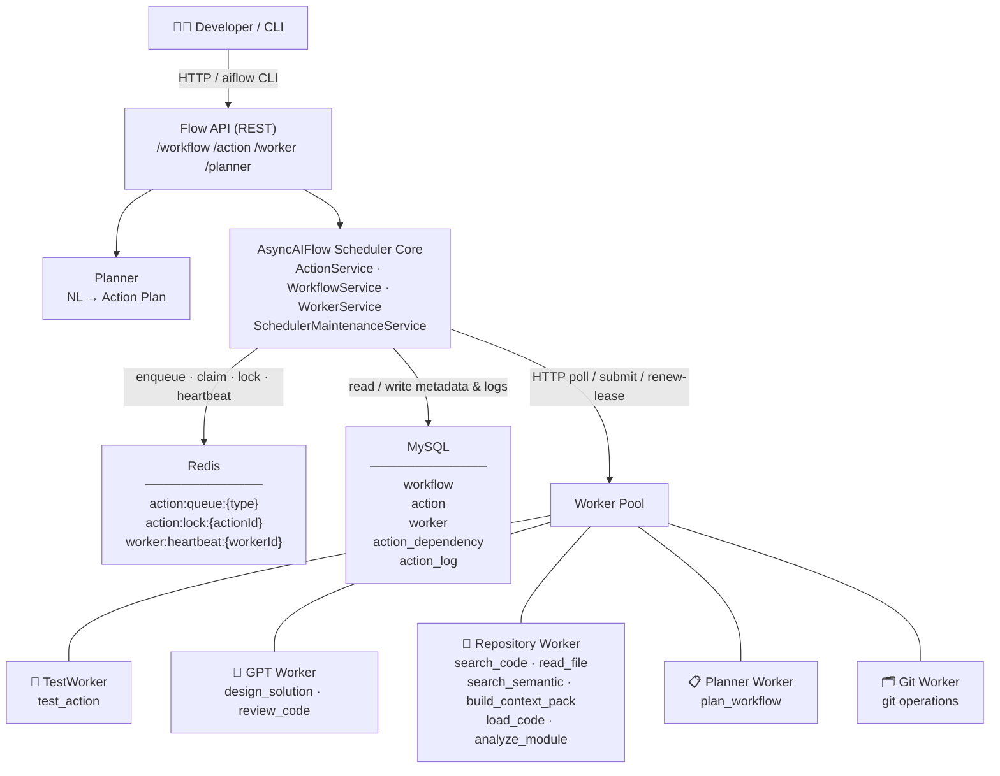
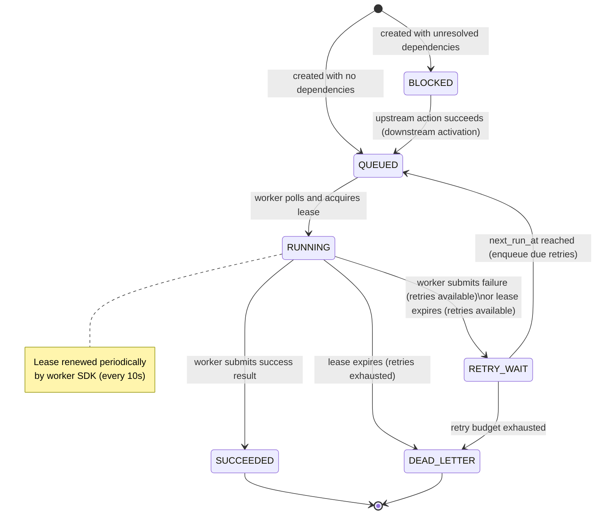
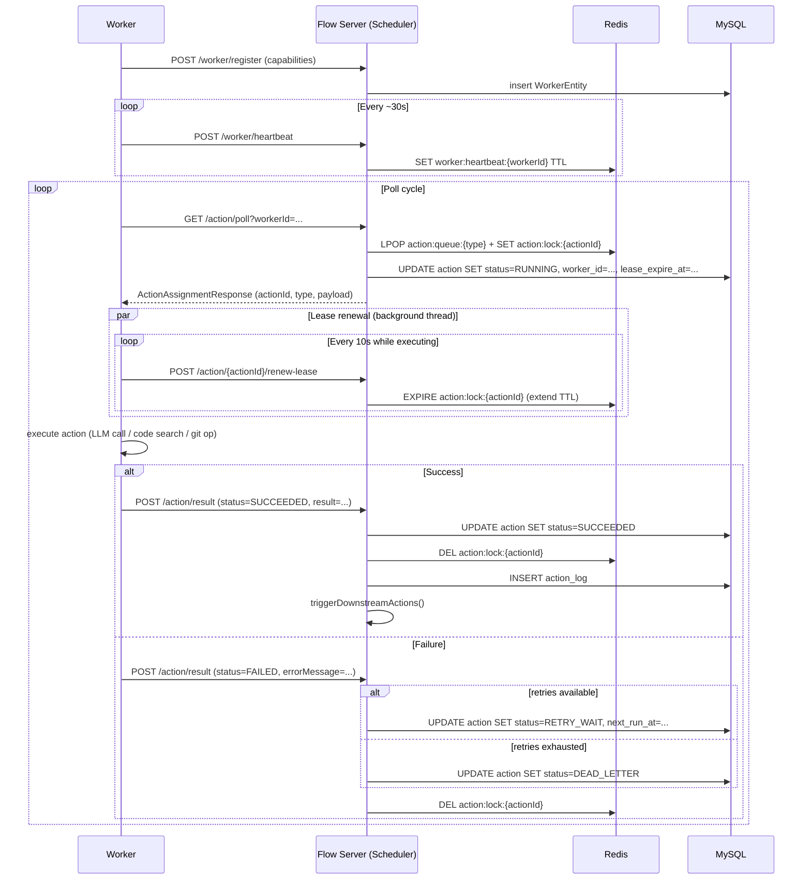
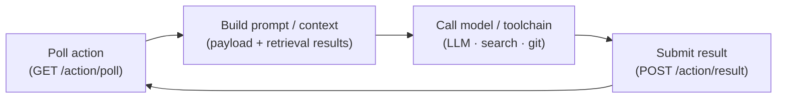
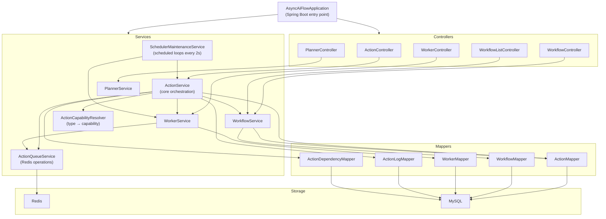

# AsyncAIFlow Architecture

## 1. System Overview

AsyncAIFlow is an action-oriented orchestration engine for AI development workflows.

It schedules Action instances instead of scheduling agents directly.

High-level architecture:

Current system status:

- Scheduler core is production-like for reliability baseline.
- Worker protocol and SDK are stable and reusable.
- Reference worker and first AI worker are both operational.

## 2. Scheduler Core

Scheduler Core owns workflow progression and reliability policy.

Core responsibilities:

- workflow and action lifecycle management
- DAG dependency resolution and downstream activation
- capability-based dispatch with explicit actionType -> requiredCapability resolution
- lease assignment and ownership
- lease renewal for long-running execution
- timeout reclaim
- retry and backoff
- dead-letter termination
- worker liveness maintenance

Core reliability mechanisms:

- lease: prevents concurrent ownership under normal conditions
- heartbeat: tracks worker liveness
- reclaim: recovers timed-out running actions
- retry_wait: delays and requeues retriable failures
- dead_letter: isolates exhausted failures

Design boundary:

- Scheduler decides "when and where to run".
- Worker decides "how to execute".

## 3. Action Model

Action is the smallest schedulable execution unit.

Action state machine:

Typical action states:

- BLOCKED
- QUEUED
- RUNNING
- RETRY_WAIT
- SUCCEEDED
- FAILED
- DEAD_LETTER

Important action fields:

- type: dispatch key and capability contract
- payload: execution input (JSON string)
- workerId: current lease owner
- leaseExpireAt: execution lease deadline
- retryCount and maxRetryCount: retry budget
- backoffSeconds and nextRunAt: retry scheduling
- executionTimeoutSeconds: run timeout policy
- claimTime, firstRenewTime, lastRenewTime: lease timeline checkpoints
- submitTime and reclaimTime: terminal path timeline checkpoints
- leaseRenewSuccessCount and leaseRenewFailureCount: lease renewal counters
- lastLeaseRenewAt: timestamp of latest successful renewal
- executionStartedAt and lastExecutionDurationMs: execution timing observability
- lastReclaimReason: scheduler reclaim reason marker

Lifecycle summary:

1. Action is created.
2. If dependencies are ready, it becomes QUEUED; otherwise BLOCKED.
3. Worker poll assigns RUNNING with lease.
4. Worker submit transitions to SUCCEEDED or failure path.
5. Success may unblock downstream actions.
6. Failure/timeout may enter RETRY_WAIT or terminal state.

## 4. Worker Protocol

Worker protocol is HTTP-based and intentionally minimal.

Endpoints:

- POST /worker/register
- POST /worker/heartbeat
- GET /action/poll?workerId=...
- POST /action/{actionId}/renew-lease
- POST /action/result

Worker loop contract:

Protocol guarantees:

- scheduler remains the source of truth for orchestration state
- workers remain mostly stateless executors
- new worker types can be added without changing scheduler core

## 5. Worker Types

### TestWorker

Purpose:

- reference implementation for protocol and reliability testing

Capabilities:

- test_action

Behavior:

- random sleep and random success/failure
- payload overrides for deterministic smoke tests

### GPTWorker

Purpose:

- first AI execution worker

Capabilities:

- design_solution
- review_code

Behavior:

- builds prompts from action payload
- calls OpenAI-compatible chat completion API
- returns structured JSON result content
- supports mock fallback when no API key is provided

## 6. AI Worker Model

AI worker model in AsyncAIFlow:

Separation of concerns:

- Scheduler Core: orchestration policy and reliability
- AI Worker: model invocation and task-specific reasoning

Current execution modes for GPTWorker:

- real mode: uses configured API key and endpoint
- mock mode: deterministic fallback for local integration tests

This allows local end-to-end development without blocking on external credentials.

## 7. Context System

Current payload is an open JSON blob, which enables fast iteration.

Near-term direction is typed action schemas per action type, for stronger inter-worker interoperability.

Example target schemas:

- design_solution: issue, context, constraints
- review_code: diff, code, focus, architectureRules
- search_code: query, scope
- trace_dependency: entryPoint, depth

Context assembly sources (planned):

- issue metadata
- repository snippets
- dependency graph
- test output and failure logs
- architecture constraints

Goal:

- make worker outputs composable and machine-consumable across multiple worker types.

Action schema baseline document:

- [docs/action-schema.md](docs/action-schema.md)

## 8. Future Extensions

Priority order (short to medium term):

1. Typed action schema and validation contract expansion.
2. Zread worker for repository context actions.
3. Action-level observability and metrics.

Recommended non-goals for current stage:

- visual workflow editor
- complex DSL
- multi-tenant and RBAC expansion

These should wait until scheduler-worker stability is proven over longer-running workloads.

## Appendix: Internal Component Dependency Graph

Server-side component relationships:

## Appendix: Architectural Invariants

Operational invariants to keep:

- Scheduler Core remains policy owner.
- Worker protocol stays small and stable.
- Workers are pluggable and replaceable.
- Action type resolves to required capability before assignment.
- Reliability logic stays centralized in scheduler.

Capability model details:

- [docs/worker-capability-model.md](docs/worker-capability-model.md)
